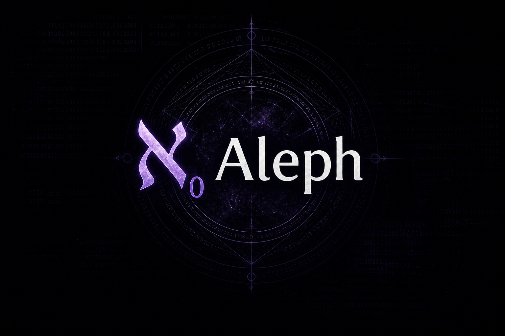

# Aleph

A lightweight Rust-based binary analysis toolkit built on top of the `object`, `capstone` crates.  
Designed for reverse engineers who want fast, structured access to ELF / PE / Mach-O metadata.

Planned:

- Analysis Graph Layer (petgraph-based)
- Disassembly Engine (capstone)
- Cross-references graph
- Control flow graph
